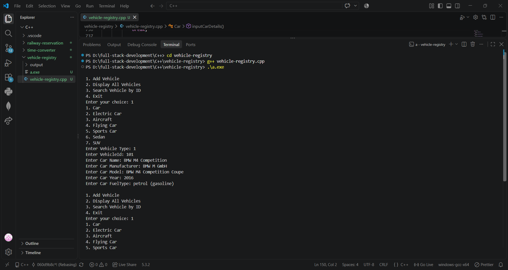

# 🔵 Vehicle Registry — C++ OOP Vehicle Management System

> **Shaping "Skills" for "Scaling" Higher...!!!**

## 📌 Project Description

This project is a **Vehicle Registry and Management System** developed using **C++ Object-Oriented Programming (OOP)** concepts.

The objective of this project is to understand and demonstrate how different OOP concepts such as **classes, objects, inheritance, multiple inheritance, constructors, destructors, encapsulation, static data members, and arrays of objects** can be used to develop a real-world vehicle management application.

The system supports different types of vehicles including **Car, Electric Car, Aircraft, Flying Car, Sports Car, Sedan, and SUV**.

Users can add different vehicles, display all registered vehicles, and search for a particular vehicle using its ID.

---

## 🎯 Objectives

- Understand the fundamentals of Object-Oriented Programming in C++.
- Learn how to create classes and objects.
- Understand inheritance between different classes.
- Practice multilevel and multiple inheritance.
- Learn how constructors and destructors work.
- Understand getters and setters for data encapsulation.
- Store multiple objects using arrays.
- Develop a menu-driven C++ application.
- Search vehicle records using Vehicle ID.
- Improve logical thinking and object-oriented programming skills.

---

## 🛠️ Technology Used

- **C++ Language**
- **Object-Oriented Programming (OOP)**
- **Classes & Objects**
- **Inheritance**
- **Multiple Inheritance**
- **Multilevel Inheritance**
- **Constructors & Destructors**
- **Encapsulation**
- **Static Data Members**
- **Arrays of Objects**
- **Switch-Case**
- **Loops**
- **Visual Studio Code**
- **Git & GitHub**

---

# 📚 Project Modules

## Q1. Vehicle Base Class

### Problem Statement

Develop a base **Vehicle class** that stores common information related to vehicles.

The Vehicle class stores information such as:

- Vehicle ID
- Vehicle Name
- Manufacturer
- Model
- Manufacturing Year

The class uses private data members along with public setter and getter methods.

### Concept Used

- Class and Object
- Encapsulation
- Private Data Members
- Getter Methods
- Setter Methods
- Constructor
- Destructor
- Static Data Member

---

## Q2. Car Class

### Problem Statement

Develop a **Car class** by inheriting the properties of the Vehicle class.

In addition to the common vehicle information, the Car class stores the **Fuel Type** of the vehicle.

The user can enter complete car information and display the stored car details.

### Concept Used

- Single Inheritance
- Base Class
- Derived Class
- Getter and Setter Methods
- Constructor
- User Input
- Data Display

---

## Q3. Sedan Class

### Problem Statement

Develop a **Sedan class** by inheriting the Car class.

The Sedan class allows the user to enter and display information about Sedan vehicles including Vehicle ID, name, manufacturer, model, year, and fuel type.

### Concept Used

- Multilevel Inheritance
- Inherited Member Functions
- Constructors
- Getter and Setter Methods
- Object-Oriented Programming

---

## Q4. SUV Class

### Problem Statement

Develop an **SUV class** by inheriting the Car class.

The program accepts complete information about an SUV and displays the stored details whenever required.

### Concept Used

- Multilevel Inheritance
- Class Hierarchy
- Getter and Setter Methods
- Input and Display Functions
- Code Reusability

---

## Q5. Electric Car Class

### Problem Statement

Develop an **ElectricCar class** by inheriting the Car class.

Along with the normal car information, the Electric Car class stores additional information about the vehicle's **Battery Capacity**.

### Concept Used

- Inheritance
- Additional Data Members
- Constructor
- Getter and Setter Methods
- Battery Capacity Management
- Code Reusability

---

## Q6. Sports Car Class

### Problem Statement

Develop a **SportsCar class** by inheriting the ElectricCar class.

The Sports Car class stores an additional **Top Speed** value and provides functions to accept and display the top speed of the vehicle.

### Concept Used

- Multilevel Inheritance
- Derived Class
- Additional Properties
- Getter and Setter Methods
- Constructor Chaining

---

## Q7. Aircraft Class

### Problem Statement

Develop an **Aircraft class** that stores information related to an aircraft.

The class manages:

- Aircraft ID
- Flight Range

The user can enter aircraft information and display the stored aircraft details.

### Concept Used

- Class and Object
- Encapsulation
- Constructor
- Getter and Setter Methods
- Input and Display Functions

---

## Q8. Flying Car Class

### Problem Statement

Develop a **FlyingCar class** that inherits properties from both the **Car** and **Aircraft** classes.

The Flying Car stores normal vehicle information along with its flight range.

This demonstrates how a single class can inherit properties from more than one parent class.

### Concept Used

- Multiple Inheritance
- Multiple Base Classes
- Constructor Chaining
- Car Properties
- Aircraft Properties
- Code Reusability

---

## Q9. Vehicle Registry

### Problem Statement

Develop a **VehicleRegistry class** to manage all vehicle records in the system.

The registry maintains separate collections for:

- Cars
- Electric Cars
- Aircrafts
- Flying Cars
- Sports Cars
- Sedans
- SUVs

The Vehicle Registry allows users to add vehicles, display all registered vehicles, and search for vehicles.

### Concept Used

- Arrays of Objects
- Object Management
- Multiple Classes
- Counters
- Functions
- Loops
- Switch-Case

---

# ⚙️ Main Features

## 1. Add Vehicle

The system provides different vehicle categories while adding a new vehicle.

```text
1. Car
2. Electric Car
3. Aircraft
4. Flying Car
5. Sports Car
6. Sedan
7. SUV

```

The user selects the required vehicle type and enters its corresponding information.

---

## 2. Display All Vehicles

The system can display all registered vehicle records.

It checks each vehicle category and displays the information stored in the corresponding object array.

---

## 3. Search Vehicle by ID

The user can enter a **Vehicle ID** to search for a particular registered vehicle.

The program checks the stored records of different vehicle categories.

If the matching ID is found, the corresponding vehicle information is displayed.

If no matching record exists, the program displays:

```text
Vehicle not found.

```

---

## 4. Exit

The user can select the Exit option to terminate the Vehicle Registry program.

```text
Exiting...

```

---

# 🖥️ Main Menu

The program provides the following menu:

```text
1. Add Vehicle
2. Display All Vehicles
3. Search Vehicle by ID
4. Exit

Enter your choice:

```

The menu continues to execute until the user selects option **4**.

---

# 📸 Output Section

## Output 1 — Main Menu

```text
1. Add Vehicle
2. Display All Vehicles
3. Search Vehicle by ID
4. Exit

Enter your choice:

```

### Output Screenshot



---

## Output 2 — Add Vehicle

```text
1. Car
2. Electric Car
3. Aircraft
4. Flying Car
5. Sports Car
6. Sedan
7. SUV

Enter Vehicle Type:

```

### Output Screenshot


---

## Output 3 — Display Vehicle Details

The system displays the information of vehicles that have been added to the registry.

Example:

```text
VehicleID: 101
Car Name: Swift
Car Manufacturer: Maruti
Car Model: VXI
Car Year: 2025
Car FuelType: Petrol

```

### Output Screenshot


---

## Output 4 — Search Vehicle by ID

```text
Enter Vehicle ID to Search: 101

VehicleID: 101
Car Name: Swift
Car Manufacturer: Maruti
Car Model: VXI
Car Year: 2025
Car FuelType: Petrol

```

If the entered ID does not exist:

```text
Vehicle not found.

```

### Output Screenshot


---

## Output 5 — Electric Car Details

```text
VehicleID: 102
Car Name: Mahindra BE 6
Car Manufacturer: Mahindra
Car Model: BE 6
Car Year: 2025
Car FuelType: Electric
Battery Capacity: 79 kWh
```

### Output Screenshot


---

# 📂 Project Structure

```text
Vehicle-Registry/
│
├── vehicle-registry.cpp
│
├── output/
│   └── output1.png
│
└── README.md

```

---

# 🧠 OOP Concepts Implemented

## Encapsulation

Private data members are used to protect vehicle information, while public getter and setter methods provide controlled access to the data.

---

## Inheritance

Different vehicle classes inherit common properties from their parent classes.

Example:

```text
Vehicle
   │
   └── Car
        │
        ├── Sedan
        ├── SUV
        └── ElectricCar
              │
              └── SportsCar

```

---

## Multiple Inheritance

The `FlyingCar` class inherits from both:

```text
Car
  \
   → FlyingCar
  /
Aircraft

```

This allows FlyingCar to use both normal car properties and aircraft-related flight information.

---

## Constructors

Constructors are used to initialize objects and vehicle information when objects are created.

---

## Destructors

A destructor is implemented in the Vehicle class to update the total vehicle count when an object is destroyed.

---

## Static Data Member

A static variable is used in the Vehicle class to maintain information related to the total number of Vehicle objects.

---

## Arrays of Objects

Arrays of different vehicle objects are maintained inside the VehicleRegistry class.

This allows the system to store multiple:

- Cars
- Electric Cars
- Aircrafts
- Flying Cars
- Sports Cars
- Sedans
- SUVs

---

# 💡 Learning Outcomes

After completing this project, I learned:

- How classes and objects work in C++.
- How to implement encapsulation using private data members.
- How getter and setter methods are used.
- How constructors initialize objects.
- How destructors work when objects are destroyed.
- How single inheritance works.
- How multilevel inheritance works.
- How multiple inheritance works.
- How one class can reuse properties and functions of another class.
- How arrays of objects can store multiple records.
- How to create a menu-driven C++ program.
- How to use `switch-case` for multiple operations.
- How to search objects using their IDs.
- How different OOP concepts can be combined into one project.
- How to develop a structured real-world C++ application.

---

# 📋 Assignment Information

**Project:** Vehicle Registry

**Topic:** Object-Oriented Programming & Inheritance

**Language:** C++

**Application Type:** Console Application

**Platform:** Visual Studio Code

**Main Concepts:** Classes, Objects, Inheritance, Encapsulation & Arrays of Objects

---

# 👨‍💻 Author

**mohammed alikhan**

GitHub Repository:

**Vehicle Registry — C++ OOP Vehicle Management System**

---

# ⭐ Conclusion

This project helped in understanding the fundamentals and practical implementation of **Object-Oriented Programming in C++**.

Different classes such as Vehicle, Car, Electric Car, Sports Car, Sedan, SUV, Aircraft, and Flying Car were created to demonstrate different forms of inheritance and code reusability.

The Vehicle Registry class combines these concepts into a menu-driven system where users can **add vehicles, display registered vehicles, and search vehicles using their IDs**.

The main purpose of this project is to improve understanding of **C++ OOP concepts, inheritance, encapsulation, constructors, arrays of objects, and logical programming**.

---

## 🚀 Project Status

**Completed ✅**

The **Vehicle Registry Management System** has been implemented using **C++ Object-Oriented Programming concepts**.
